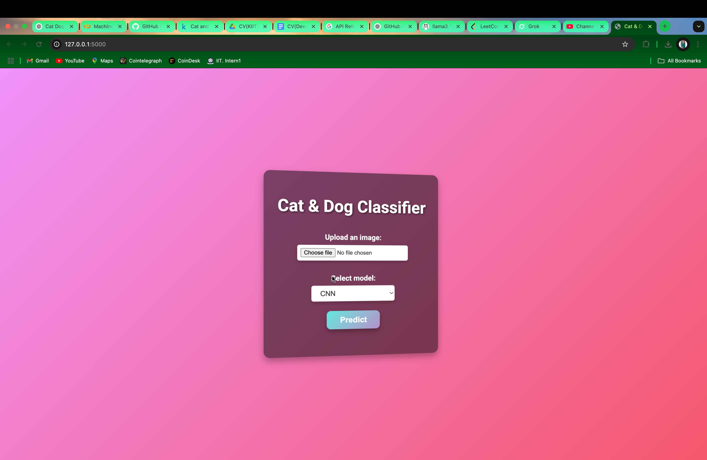
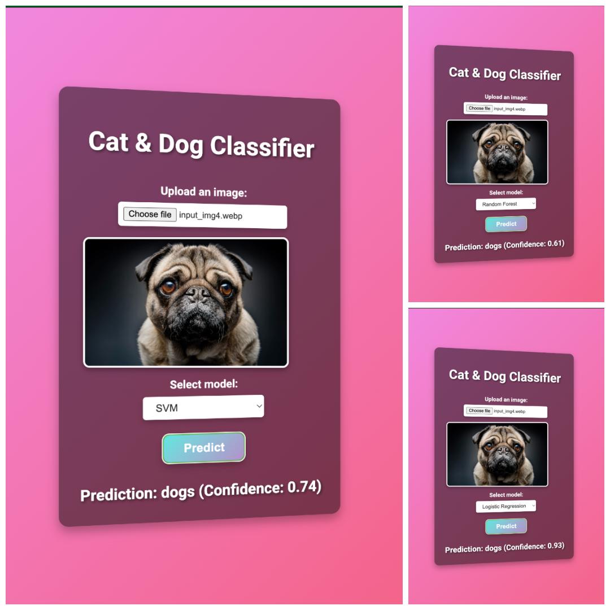
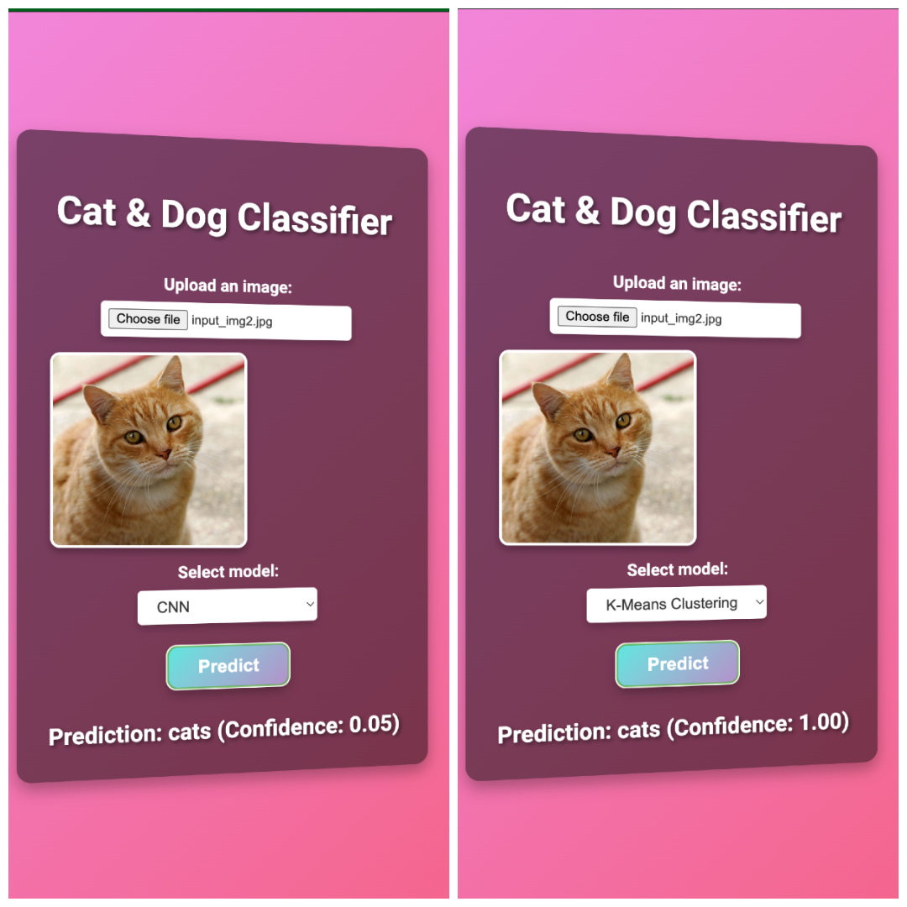

<h1 style="text-align:center; color:#FF6347;">Cats &amp; Dogs Image Classifier</h1>

  <em>A Machine Learning &amp; Deep Learning project for classifying cat or dog images</em>

<h2 style="color:#4169E1;">1. Overview</h2>

This repository demonstrates a <strong>full-stack ML project</strong> to classify images as cats or dogs using both:

<ul>
  <li>Traditional ML Models (SVM, RandomForest, LogisticRegression, K-Means)</li>
  <li>A Transfer Learning CNN (e.g., VGG16)</li>
</ul>

We provide a vibrant Flask UI for uploading images, generating predictions, and displaying results in real time.

<h2 style="color:#4169E1;">2. Project Structure</h2>

<pre>
Cats & Dogs Classification/
├── backend/
│   ├── app.py                # Flask app with routes & preprocessing
│   ├── templates/
│   │   └── index.html        # Vibrant UI with file upload & preview
│   └── static/
│       ├── css/style.css     # Vibrant CSS
│       └── js/script.js      # JS for AJAX & preview
├── colab/
│   └── Machine_Learning_Cat_Dog_Classification.ipynb
├── dataset/
│   ├── test_set/
│   │   └── test_set/
│   │       ├── cats/
│   │       └── dogs/
│   └── training_set/
│       └── training_set/
│           ├── cats/
│           └── dogs/
├── models/
│   ├── cnn_model.h5
│   ├── kmeans_model.pkl
│   ├── label_encoder.pkl
│   ├── lr_model.pkl
│   ├── rf_model.pkl
│   ├── scaler.pkl
│   └── svm_model.pkl
├── screenshots/
│   ├── homepage.png
│   ├── output_img1.png
│   └── output_img2.png
├── readme.md
├── requirements.txt
└── .gitignore
</pre>

<h2 style="color:#4169E1;">3. Screenshots</h2>

   
  <em>Figure 1: Homepage with Vibrant UI</em>

  
   
  <em>Figure 2 &amp; 3: Sample Outputs</em>

<h2 style="color:#4169E1;">4. Demo Video</h2>

Check out the full website demonstration here: 
<a href="https://youtu.be/x_x06ELUlO0?si=L74MMuVkQNA6Ol-S" target="_blank">Cats &amp; Dogs Classifier - Demo</a>

<h2 style="color:#4169E1;">5. Requirements</h2>
<ol>
  <li>Python 3.7+</li>
  <li>Flask, OpenCV, NumPy, scikit-learn, TensorFlow, Keras, joblib, etc.</li>
  <li>Install dependencies using <code>pip install -r requirements.txt</code></li>
</ol>

<h2 style="color:#4169E1;">6. Training Steps</h2>
<ol>
  <li>Use <code>colab/Machine_Learning_Cat_Dog_Classification.ipynb</code> to train ML &amp; CNN models on <code>tongpython/cat-and-dog</code> dataset (or your own data).</li>
  <li>Generates <code>.pkl</code> files for scikit-learn models &amp; <code>.h5</code> for CNN in <code>models/</code>.</li>
</ol>

<h2 style="color:#4169E1;">7. Usage</h2>
<ol>
  <li><strong>Run Flask:</strong>
    <pre><code>cd backend
python3 app.py
</code></pre>
  </li>
  <li><strong>Navigate to:</strong> <em>http://127.0.0.1:5000</em></li>
  <li><strong>Upload an image</strong>, pick a model (CNN, SVM, etc.), and see the classification result.</li>
</ol>

<h2 style="color:#4169E1;">8. Contributing</h2>

Feel free to open issues or PRs for improvements or bug fixes.

<h2 style="color:#4169E1;">9. License</h2>

This project is licensed under the <strong>MIT License</strong>.

  <em>Made with ❤️ by <strong>Deep Habiswashi</strong></em>

